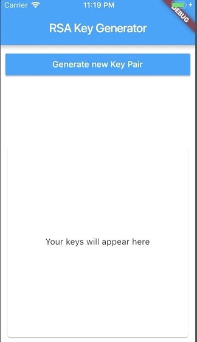

# Flutter RSA Key Generator

This project shows how to use [Pointy Castle](https://github.com/PointyCastle/pointycastle) to generate a RSA Key and encode it to a PKCS1 Pem String.



In order to generate a new `RSA Keypair` we use `RSAKeyGenerator`

```
AsymmetricKeyPair<PublicKey, PrivateKey> computeRSAKeyPair(
    SecureRandom secureRandom) {
  var rsapars = new RSAKeyGeneratorParameters(BigInt.from(65537), 2048, 12);
  var params = new ParametersWithRandom(rsapars, secureRandom);
  var keyGenerator = new RSAKeyGenerator();
  keyGenerator.init(params);
  return keyGenerator.generateKeyPair();
}
```

To be able generate the keys in a background thread we use Dart's [Isolate](https://api.dartlang.org/stable/2.1.0/dart-isolate/dart-isolate-library.html) implemented in Flutter's [compute](https://docs.flutter.io/flutter/foundation/compute.html). We must ensure that the `computeRSAKeyPair` function is placed __outside__ a `Class` so that it can be called globally.

```
Future<AsymmetricKeyPair<PublicKey, PrivateKey>> getRSAKeyPair(
  SecureRandom secureRandom) async {
  return await compute(computeRSAKeyPair, secureRandom);
}
```
